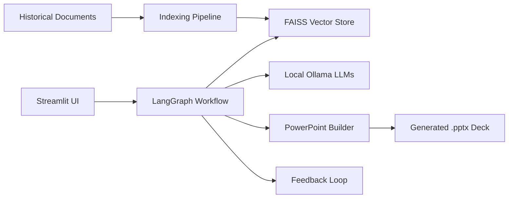

````carousel
# AI-Driven Proposal Development Tool
### Case Study Presentation

**Transforming RFP Responses with Local Generative AI**

*A consultant-in-the-loop solution for automated, secure, and highly-relevant proposal generation.*

<!-- slide -->
## 1. The Challenge

Consulting teams face significant bottlenecks during proposal development:

> [!WARNING]
> **Key Pain Points**
> - **Knowledge Silos:** Historical proposals and templates are hard to find and search.
> - **Manual Effort:** Tailoring old content to a new RFP takes hours of manual rewriting.
> - **Formatting Overhead:** Preserving slide narrative and design consistency is tedious.
> - **Data Security:** Strict confidentiality prevents the use of public LLM APIs (e.g., ChatGPT).

<!-- slide -->
## 2. The Solution

An end-to-end AI accelerator that ingests an RFP and produces a consultant-ready `.pptx` deck.

**Core Capabilities:**
1. **100% Local AI:** Uses `Ollama` for local LLM inference, ensuring zero data leakage.
2. **Enterprise RAG:** FAISS vector index retrieves relevant historical proposals and templates.
3. **Agentic Orchestration:** `LangGraph` workflow ensures deterministic and logical generation steps.
4. **Direct PPT Export:** Outputs a structured PowerPoint presentation natively.

<!-- slide -->
## 3. High-Level Architecture



<!-- slide -->
## 4. Step-by-Step Workflow

**How it works from upload to deliverable:**

1. **Upload & Parse:** User uploads RFP (PDF/DOCX) via Streamlit UI. System extracts facts.
2. **Summarize & Query:** System builds a retrieval query from the RFP summary.
3. **Retrieve Context:** FAISS searches historical proposals for matching evidence and templates.
4. **Gap Analysis:** Identifies missing information by comparing the RFP to retrieved capabilities.
5. **Generate Sections:** LLM drafts content slide-by-slide, grounding outputs in retrieved data.
6. **Evaluate & Build PPT:** System validates outputs, exports to `.pptx`, and captures human feedback.

<!-- slide -->
## 5. Technology Stack

- **User Interface:** Streamlit
- **Orchestration:** LangGraph & LangChain
- **Language Models:** Ollama (Llama 3.1, Mistral, Nomic Embeddings)
- **Vector Database:** FAISS
- **Document Processing:** Unstructured & python-pptx
- **Deployment:** Docker & Docker Compose

<!-- slide -->
## 6. Business Impact

> [!TIP]
> **Key Results & Value Delivered**
> - ⚡ **Accelerated Delivery:** Time spent drafting reduced from days to hours.
> - 🎯 **Higher Relevance:** Proposals are grounded in past wins, preventing "generic AI text."
> - 🔒 **Guaranteed Compliance:** Complete on-premises execution satisfies infosec requirements.
> - 🔄 **Continuous Improvement:** Built-in evaluation and feedback loops make the system smarter over time.
````
