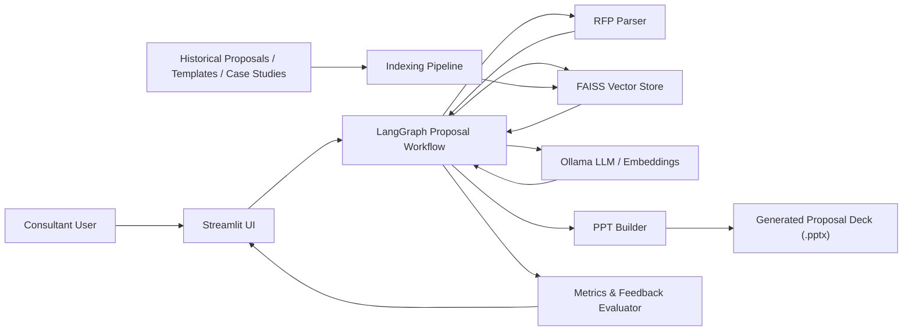
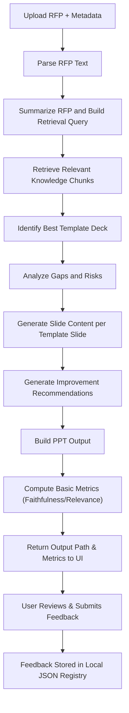

# High Level Design

## 1. Document Overview

### 1.1 Purpose
This document describes the High Level Design for the `AI-Driven Proposal Development Tool`. The application helps consulting teams transform an uploaded RFP into a consultant-reviewable proposal deck by combining:

- RFP parsing
- Retrieval-Augmented Generation
- FAISS-based enterprise knowledge search
- LangGraph-based workflow orchestration
- Ollama-hosted local language models
- Output Evaluation and Human Feedback Loop
- PowerPoint deck generation

### 1.2 Goals

- Accelerate proposal drafting from unstructured RFP input
- Reuse historical proposal content and templates in a governed way
- Preserve template storyline and slide sequence from reference proposal decks
- Generate fresh proposal content based on the active RFP
- Support enterprise-friendly local deployment with Docker and Ollama
- Provide objective evaluation metrics on output quality (Faithfulness, Relevance, Completeness)
- Produce a `.pptx` deliverable instead of plain text output

### 1.3 Scope
In scope:

- Upload of RFP files in `PDF`, `DOCX`, or `TXT`
- Ingestion of historical `PDF`, `DOCX`, `PPTX`, and `TXT` proposal assets
- Chunking and indexing into `FAISS`
- Retrieval of relevant evidence and template slides
- Slide-by-slide generation using RFP + retrieved context
- Automated Quality Evaluation (Faithfulness, Relevance, Completeness)
- Consultant Feedback Capture (Rating and Comments)
- Proposal deck export in `PPTX`
- Local deployment via Docker Compose

Out of scope:

- Authentication and role-based access control
- Repository connectors like SharePoint, S3, or Confluence
- Template-preserving visual cloning of the reference PPT
- Multi-node distributed clustering (runs locally or on a single beefy VM)

## 2. Business Context

Proposal teams often lose time in three places:

- locating reusable proposal material across old decks and documents
- tailoring prior content to the current RFP without copying stale material
- maintaining narrative consistency and proposal quality across slides

This application addresses those problems by using historical content as reference memory, not as a copy source. The selected template deck provides the storyline and slide order, while the RFP provides the active business context for content generation. The newly added Evaluation and Feedback layers ensure that AI outputs are consistently monitored and improved upon by human consultants.

## 3. Solution Summary

The system follows a layered architecture:

1. `Presentation Layer`
   Streamlit-based UI for metadata capture, RFP upload, generation trigger, evaluation viewing, and feedback entry.
2. `Application Orchestration Layer`
   LangGraph workflow coordinating parsing, retrieval, analysis, generation, and export.
3. `Knowledge Retrieval Layer`
   FAISS vector search over chunked historical content.
4. `Generation & Evaluation Layer`
   Ollama-hosted LLMs for summarization, gap analysis, recommendations, per-slide content generation, and metrics evaluation.
5. `Delivery Layer`
   PowerPoint builder producing a consultant-ready `.pptx`.
6. `Deployment Layer`
   Docker containerization orchestrating the Python app and mounting local volumes for FAISS/PPT persistence.

## 4. Architecture Diagram

## 5. Logical Components

### 5.1 Streamlit UI
Responsibilities:

- capture client metadata
- upload RFP document
- trigger the LangGraph workflow
- display executive summary, risks, citations, generated sections, and output file path
- display Evaluation Dashboard (Faithfulness, Relevance, Completeness)
- capture human feedback (Thumbs up/down and comments)

Primary file:
- `app.py`

### 5.2 Ingestion Layer
Responsibilities:

- read multi-format content from the document repository
- extract text from `PDF`, `DOCX`, `PPTX`, and `TXT`
- preserve slide-level structure for PowerPoint templates

Primary files:
- `src/services/ingestion/loaders.py`
- `src/services/ingestion/chunking.py`

### 5.3 Knowledge Layer
Responsibilities:

- embed text chunks
- persist and load FAISS indices
- serve retrieval queries for proposal content and template deck identification

Primary files:
- `src/services/retrieval/vector_store.py`
- `src/services/retrieval/retrieval_service.py`

### 5.4 Orchestration Layer
Responsibilities:

- coordinate the end-to-end proposal workflow
- maintain state between stages
- guarantee deterministic execution order

Primary files:
- `src/graph/builder.py`
- `src/graph/state.py`

### 5.5 LLM Layer
Responsibilities:

- summarize RFP
- create retrieval query
- analyze gaps and risks
- generate slide content using template storyline and RFP facts

Primary files:
- `src/services/llm/ollama_factory.py`
- `src/services/generation/proposal_generator.py`
- `src/services/generation/prompt_templates.py`

### 5.6 Output Layer
Responsibilities:

- create title slide
- paginate and format slide bullets
- export final `.pptx`

Primary file:
- `src/services/ppt/ppt_builder.py`

### 5.7 Evaluation and Feedback Layer
Responsibilities:
- Calculate metrics mapping generated output to the initial RFP and retrieved context
- Store human feedback to a JSON-lines registry for future analysis
- Auto-extract common negative themes from user feedback to warn future users

Primary files:
- `src/services/evaluation/metrics.py`
- `src/services/evaluation/feedback_store.py`
- `src/services/generation/prompt_optimizer.py`

## 6. End-to-End Workflow

## 7. Key Design Decisions

### 7.1 FAISS for Vector Search
FAISS is used because it is lightweight, fast, local, and appropriate for desktop or enterprise-internal deployments.

### 7.2 LangGraph for Workflow Governance
LangGraph is used to model the proposal generation lifecycle as explicit steps rather than a single black-box prompt. This improves observability, maintainability, and debugging.

### 7.3 Ollama for Local Model Execution
Ollama allows the solution to run with local models, which is critical for confidential consulting content and enterprise environments where external SaaS APIs may not be approved.

### 7.4 Dockerized Deployment
We encapsulate the Python runtime in a Docker container via `docker-compose.yml`, while pointing `OLLAMA_BASE_URL` to `host.docker.internal` so the local host's GPU-accelerated Ollama instance can handle inference rapidly. 

### 7.5 Flattened Package Structure
The architecture eschews unnecessary proxy wrappers, opting for a clean `src/services/` and `core/` model that natively maps responsibilities (retrieval, ingestion, llm, ppt) without cognitive overhead.

## 8. Non-Functional Considerations

### 8.1 Security
- Local model execution through Ollama keeps indexed proposal assets on local storage.
- Avoids sending proposal content to public hosted LLMs.

### 8.2 Maintainability
- Modular package structure separates logic cleanly.
- `core/config.py` acts as the single source of truth for runtime configurations.

### 8.3 Performance
- LLM inference depends heavily on the host GPU. Dockerizing the application while running Ollama on the bare metal avoids virtualization overhead for the inference server.

## 9. Future Enhancements

- Explicit UI-based template deck selection.
- Visual template reuse from the source PPT (cloning graphics and logos).
- Repository connectors for enterprise document stores (SharePoint/Confluence).
- Automated Prompt Optimization (feeding aggregated feedback themes directly into the system prompt).
