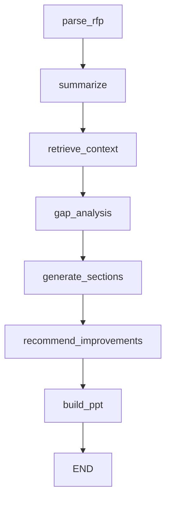

# Low Level Design

## 1. Document Overview

### 1.1 Purpose
This document describes the Low Level Design for the `AI-Driven Proposal Development Tool`. It explains the internal package structure, file responsibilities, state model, module interactions, and data flow for the implemented application.

### 1.2 Reference Codebase
Primary implementation root:
- `src/`
- `core/`

UI entry point:
- `app.py`

## 2. Package Structure

```text
.
|-- app.py
|-- pyproject.toml
|-- core/
|   |-- config.py
|   |-- constants.py
|   `-- logger.py
`-- src/
    |-- graph/
    |   |-- builder.py
    |   |-- state.py
    |   `-- nodes/
    |       |-- generate.py
    |       |-- parse.py
    |       `-- retrieval.py
    |-- schemas/
    |   `-- state_schema.py
    |-- scripts/
    |   |-- evaluate_pipeline.py
    |   `-- index_documents.py
    `-- services/
        |-- evaluation/
        |   |-- feedback_store.py
        |   `-- metrics.py
        |-- generation/
        |   |-- prompt_optimizer.py
        |   |-- prompt_templates.py
        |   `-- proposal_generator.py
        |-- guardrails/
        |   |-- hallucination.py
        |   `-- validation.py
        |-- ingestion/
        |   |-- chunking.py
        |   |-- loaders.py
        |   |-- preprocess.py
        |   `-- rfp_parser.py
        |-- llm/
        |   `-- ollama_factory.py
        |-- ppt/
        |   `-- ppt_builder.py
        `-- retrieval/
            |-- query_rewriter.py
            |-- retrieval_service.py
            `-- vector_store.py
```

## 3. Configuration Design

File: `core/config.py`

### 3.1 `Settings`
`Settings` extends `BaseSettings` and reads configuration from `.env`.

Fields:
- `ollama_base_url`: Ollama server endpoint (set to `http://host.docker.internal:11434` for Docker)
- `ollama_chat_model`: chat model name
- `ollama_embed_model`: embedding model name
- `vector_store_path`: local FAISS persistence path
- `output_dir`: generated PPT output directory
- `max_chunk_size`: chunk length during indexing
- `chunk_overlap`: overlap between chunks
- `top_k_results`: retrieval depth

### 3.2 `get_settings()`
Memoized factory using `lru_cache` to avoid repeated settings reinitialization and to dynamically create required output directories.

## 4. Data Contracts

### 4.1 UI Input Model
File: `src/schemas/state_schema.py`

`ProposalInput` includes:
- `rfp_path`
- `country`
- `sector`
- `domain`
- `client`
- `proposal_objective`
- `assistant_prompt`

### 4.2 Workflow State Model
File: `src/graph/state.py`

`ProposalState` acts as the runtime contract between LangGraph nodes.

Important fields:
- input variables
- `rfp_text`
- `executive_summary`, `retrieval_query`
- `retrieved_context`, `citations`
- `template_source`, `template_slides`
- `gap_analysis`, `improvement_recommendations`
- `proposal_sections`
- `ppt_output_path`

## 5. UI Layer Design

File: `app.py`

### 5.1 Responsibilities
- initialize Streamlit app
- capture engagement metadata and upload RFP
- invoke compiled LangGraph workflow
- display generated results (summary, risks, citations)
- render Evaluation Dashboard (metrics)
- capture human feedback (Thumbs Up/Down)

### 5.2 Runtime Flow
1. `get_settings()` loads configuration.
2. User uploads RFP.
3. `build_proposal_graph(settings)` returns a compiled graph.
4. `graph.invoke(initial_state)` executes the workflow.
5. UI computes metrics via `compute_basic_metrics()`.
6. UI renders outputs, metrics, and captures feedback via `save_feedback()`.

## 6. Ingestion Layer Design

### 6.1 File Loader
File: `src/services/ingestion/loaders.py`
- `load_text_from_file(file_path)`: supports `.pdf`, `.docx`, `.pptx`, and `.txt`.
- `load_documents_from_directory(directory)`: extracts full folder recursively. PPT files are extracted slide-by-slide to capture structural meta-data.

### 6.2 Chunking
File: `src/services/ingestion/chunking.py`
- Uses `RecursiveCharacterTextSplitter` to generate text snippets that preserve overlapping context.

## 7. Vector Store Design

File: `src/services/retrieval/vector_store.py`
- Converts LangChain documents to vectors via Ollama embeddings and stores them in FAISS on local disk.

## 8. Evaluation and Feedback Layer

### 8.1 Metrics
File: `src/services/evaluation/metrics.py`
- Calculates heuristic `faithfulness` (grounding ratio of bullets), `relevance` (RFP key terms overlapping in output), and `completeness` (sections generated vs template).

### 8.2 Feedback Store
File: `src/services/evaluation/feedback_store.py`
- Saves JSON-line appended objects tracking rating (positive/negative), user comment, and the quality score context. 

## 9. Generation and Guardrails

### 9.1 Proposal Generation
File: `src/services/generation/proposal_generator.py`
- Generates section content using `ChatOllama` mapped per slide layout.
- Extracts `EXEC_SUMMARY` and `RETRIEVAL_QUERY`.

### 9.2 Guardrails
File: `src/services/guardrails/hallucination.py`
- Validates the grounding risk of AI suggestions against historical context.

## 10. LangGraph Orchestration Design

File: `src/graph/builder.py`

### Node Sequence


## 11. PPT Builder Design

File: `src/services/ppt/ppt_builder.py`
- Uses `python-pptx` to build output presentation dynamically. Applies overflow pagination rules to split overly verbose AI bullets into `(contd.)` slides.

## 12. Deployment (Docker)

File: `docker-compose.yml`, `Dockerfile`
- Containerizes Python dependencies.
- Mounts `/app/data` to host machine's `./data` to persist vector stores and outputs.
- Connects to host GPU Ollama instance via `OLLAMA_BASE_URL=http://host.docker.internal:11434`.
